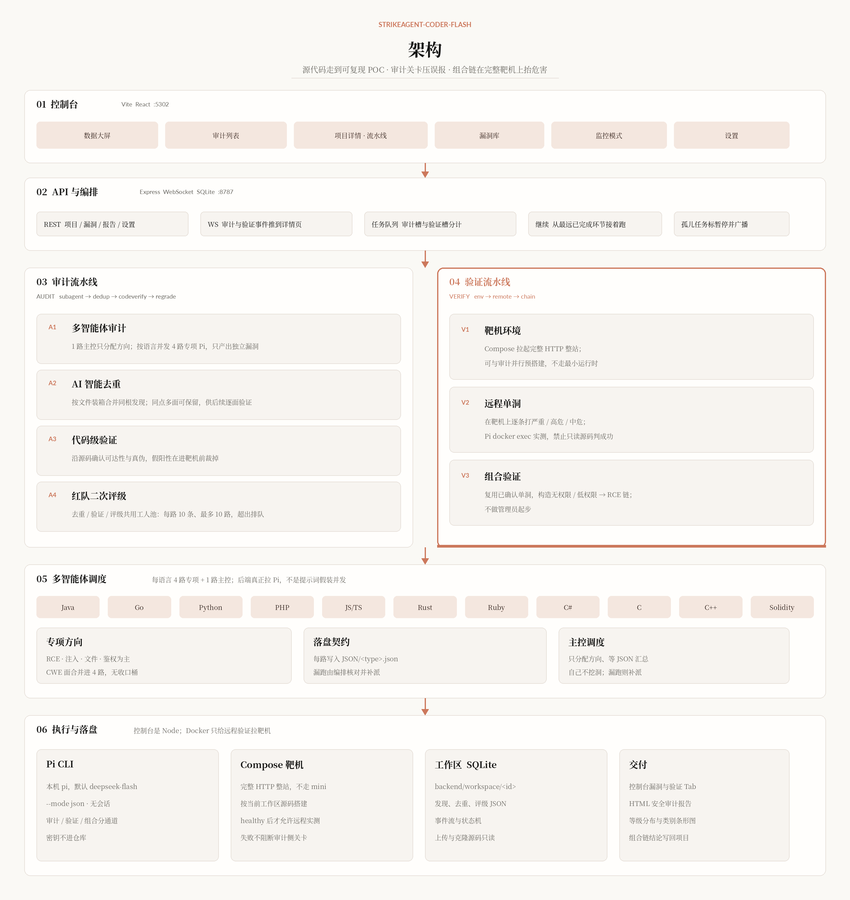
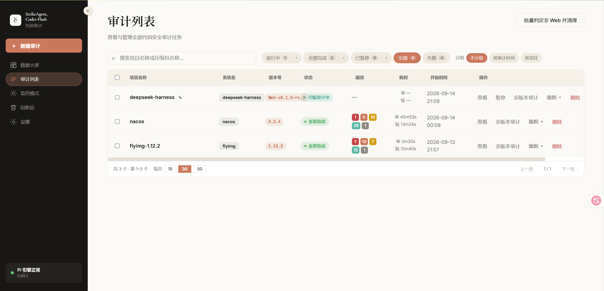
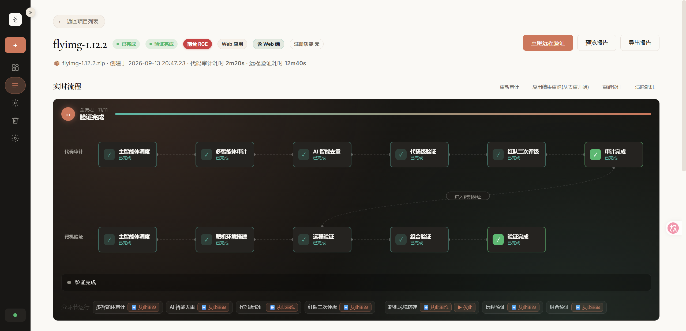
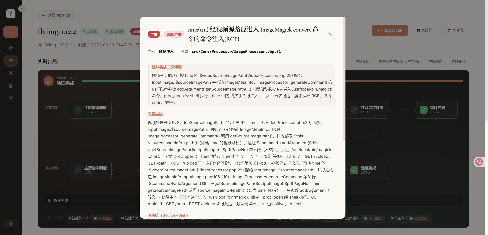

<p align="center">
  
  
  
</p>

<p align="center">
  <sub>StrikeAgent × 夜安团队 SEC</sub>
</p>

<h1 align="center">StrikeAgent_Coder-Flash</h1>


此项目由夜安团队历时四个月研发而成，经团队多位代码领域专家细心调教，Flash 由 Pro 版简化而来，也达到了 Pro 版约五分之一的检出能力，实现了从源代码到真正可利用漏洞的完整链路，希望能成为同类项目的替代方案。研发过程中，团队经历了模型训练、代码切块向量化、机器筛选污点链到审计、AI筛选污点链到AI审计等一系列创新方案，最终选择了目前这套方案，希望在效果和价格之间取得平衡。

## 架构

控制台调度审计与验证。全量审计是 1 路主控 + 每语言 4 路专项 Pi；去重、代码级验证、红队二次评级共用工人池（每路 10 条、最多 10 路）。走完这四关后，在 Compose 完整 HTTP 靶机上打单洞、拼组合链。验证可以和审计并行预搭建靶机，但不走最小运行时。



## 产品页面展示

审计列表：全部项目的进度、漏洞计数与耗时。



项目详情：代码审计与靶机验证流水线、分环节续跑。



单个漏洞详情：评级、问题描述与污点链。



## 交付报告

*此报告为一次真实的授权审计场景*


## 环境与安装说明


### Agent 部署提示词

把下面整段连同源代码交给任意能跑本机命令的 AI。它应按原文把控制台搭起来，不要把路径写死成别人的机器。

```
你要在本机把 StrikeAgent_Coder-Flash 从当前源代码部署到可打开的代码审计控制台。目标系统是 Kali / Debian 系 Linux（有 Node、能装全局 npm 包、能跑 Docker）。不要用 Docker 当本控制台的主路径（控制台是 Node 前后端；Docker 只给「远程验证」拉靶机用）。不要把任何路径写死成 /home/kali/桌面/... 或其它克隆者机器上的目录。

一、目录与进程纪律
- 仓库根记为 REPO（含 backend/、frontend/、docs/、根 package.json 的 npm workspaces）。
- 开发：后端 :8787，前端 :5302（Vite 把 /api 和 /ws 代理到 8787）。局域网要打开时 BIND_HOST=0.0.0.0。
- 生产：npm run start:web 先构建 frontend/dist，再由后端同端口 8787 托管 SPA。不要同时再起一份 npm run dev，会抢 8787。
- 数据、库、工作区、上传只写 backend/data/、backend/workspace/、backend/uploads/（已 gitignore）。不要提交 .env、*.db、workspace、data。
- 8787 已被占用 = 已有后端在跑。不要再起第二个后端，否则会双开 Pi、把同一项目跑乱。先 curl 探活，活着就复用。

二、依赖
- Node.js 18+、npm。系统包：sudo apt 安装 nodejs npm build-essential python3 curl git docker.io docker-compose-plugin（或 docker-compose）。当前用户要进 docker 组，docker ps 能跑，远程验证才能拉 Compose 完整 HTTP 靶机。
- 在 REPO 执行：npm run install:all（会 rebuild backend 的 better-sqlite3）。不要只装 frontend 或只装 backend。
- 全局安装 Pi：npm install -g --ignore-scripts @earendil-works/pi-coding-agent。本机 `pi --version` 必须能跑。
- 密钥给 Pi 用，不要写进仓库。需要 DEEPSEEK_API_KEY，或 ANTHROPIC_AUTH_TOKEN / ANTHROPIC_API_KEY（也可配在 ~/.pi/agent/settings.json 的 env）。设置页里「Pi 可执行文件」对应库键 claude_path，空则自动解析全局 pi。
- 默认审计命令形态是：pi --mode json --no-session --no-context-files --provider anthropic {prompt}。不要改回 claude CLI，Flash 版引擎是 Pi。

三、启动
- 开发（推荐，前后端热重载）：
  cd $REPO && BIND_HOST=0.0.0.0 PORT=8787 BACKEND_PORT=8787 FRONTEND_PORT=5302 npm run dev
- 生产：
  cd $REPO && BIND_HOST=0.0.0.0 PORT=8787 npm run start:web
- 不要在临时 shell 里再起一份 npm --workspace backend run dev / tsx src/index.ts，会和已有后端抢端口、重复派 Pi。

四、验收
curl -sS http://127.0.0.1:8787/api/health          期望 {"ok":true,...}
curl -sS http://127.0.0.1:8787/api/pi/health       期望能解析到本机 pi（未装 Pi 会提示 npm install -g --ignore-scripts @earendil-works/pi-coding-agent）
开发模式再打开：http://127.0.0.1:5302/   （局域网用本机 IP:5302，不要用 127.0.0.1 从另一台机器访问）
生产模式打开：http://127.0.0.1:8787/
失败先看跑 npm run dev 的终端：缺 native 模块则在 REPO 再 npm run install:all；8787 占用则不要再起后端；pi 找不到就按上面全局安装并确认密钥。
```


### 环境

建议在 **Kali Linux** 上跑（远程验证要调本机 Docker）。其它 Debian / Ubuntu 也能起控制台，但 Compose 靶机不一定齐。


| 依赖            | 版本 / 说明                                                                                      |
| ------------- | -------------------------------------------------------------------------------------------- |
| 系统            | Kali / Debian 系，能 `sudo`                                                                     |
| Node.js / npm | **18+**                                                                                      |
| Pi            | 本机 `pi` 能用：`npm i -g --ignore-scripts @earendil-works/pi-coding-agent`，配好 `DEEPSEEK_API_KEY` |
| Docker        | 当前用户能 `docker ps`；远程验证拉 Compose 完整 HTTP 靶机                                                   |
| 端口            | 开发 **5302** 控制台、**8787** API；生产只开 **8787**                                                   |
| 磁盘            | `backend/data/`、`backend/workspace/`、`backend/uploads/` 会写库与工作区，已 gitignore                  |


系统包（Kali / Debian）：

```bash
sudo apt update
sudo apt install -y nodejs npm build-essential python3 curl git \
  docker.io docker-compose-plugin
```

安装 Pi：

```bash
sudo npm install -g --ignore-scripts @earendil-works/pi-coding-agent
pi --version
```

模型密钥用环境变量即可，不要写进仓库：


| 变量                     | 作用              |
| ---------------------- | --------------- |
| `DEEPSEEK_API_KEY`     | 大模型密钥           |
| `ANTHROPIC_AUTH_TOKEN` | 密钥别名（有则自动填给 Pi） |
| `ANTHROPIC_API_KEY`    | 同上              |


### 安装

```bash
git clone <本仓库 URL>
cd StrikeAgent-Coder-Flash
npm run install:all
```

开发（推荐）：

```bash
BIND_HOST=0.0.0.0 PORT=8787 BACKEND_PORT=8787 FRONTEND_PORT=5302 npm run dev
```

浏览器打开 **[http://127.0.0.1:5302/](http://127.0.0.1:5302/)**。局域网其它机器用 `http://<kali-ip>:5302/`。

生产：

```bash
BIND_HOST=0.0.0.0 PORT=8787 npm run start:web
```

浏览器打开 **[http://127.0.0.1:8787/](http://127.0.0.1:8787/)**。

确认起来：

```bash
curl -sS http://127.0.0.1:8787/api/health
# 期望含 "ok": true

curl -sS http://127.0.0.1:8787/api/pi/health
# 期望能解析到本机 pi
```

数据在 `backend/data/`、`backend/workspace/`、`backend/uploads/`，已进 `.gitignore`。

## 开源协议与免责声明

本仓库按 [GNU Affero General Public License v3.0](LICENSE) 开源（AGPL-3.0）。

你可以复制、修改、分发本软件（包括收费），但必须保留版权与许可证声明；修改版若通过网络提供服务，必须向用户提供完整对应源代码，并以 AGPL-3.0 再许可。详见 [LICENSE](LICENSE)。

本软件仅限在已获明确授权的环境中使用。使用即表示你已获得目标环境的授权，并自行承担合规与后果。作者与夜安团队 SEC 不对滥用、数据损坏或法律纠纷负责。

交流群目前已满。关注公众号「夜安团队SEC」，联系我们拉进群。


